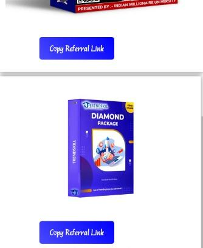

<!DOCTYPE html>
<html lang="en">
<head>
  <meta charset="UTF-8" />
  <meta name="viewport" content="width=device-width, initial-scale=1.0"/>
  <title>Abhi's Digital Marketing</title>
</head>
<body>
  <h1>Welcome to My Digital Marketing Page!</h1>
  
This is a live website hosted on GitHub Pages 🎉

</body>
</html>

  
  <h3>Course 1</h3>
  <button onclick="window.location.href='YOUR_AFFILIATE_LINK_1'">Buy Now</button>

  
  <h3>Course 2</h3>
  <button onclick="window.location.href='YOUR_AFFILIATE_LINK_2'">Buy Now</button>

  
  <h3>Course 3</h3>
  <button onclick="window.location.href='YOUR_AFFILIATE_LINK_3'">Buy Now</button>

  
  <h3>Course 4</h3>
  <button onclick="window.location.href='YOUR_AFFILIATE_LINK_4'">Buy Now</button>

  
  <h3>Course 5</h3>
  <button onclick="window.location.href='YOUR_AFFILIATE_LINK_5'">Buy Now</button>

      overflow: hidden;
      width: 300px;
      text-align: center;
    }
    .card img {
      width: 100%;
      height: auto;
    }
    .card h3 {
      margin: 10px 0;
      padding: 0 10px;
    }
    .card button {
      margin: 15px;
      padding: 10px 20px;
      background: #007bff;
      border: none;
      color: white;
      border-radius: 5px;
      cursor: pointer;
    }
    .card button:hover {
      background: #0056b3;
    }
  </style>
</head>
<body>

  <h1>Top Digital Marketing Courses</h1>
  

    

      
      <h3>Course 1</h3>
      <button onclick="window.location.href='YOUR_AFFILIATE_LINK_1'">Buy Now</button>
    

    

      
      <h3>Course 2</h3>
      <button onclick="window.location.href='YOUR_AFFILIATE_LINK_2'">Buy Now</button>
    

    

      
      <h3>Course 3</h3>
      <button onclick="window.location.href='YOUR_AFFILIATE_LINK_3'">Buy Now</button>
    

    

      
      <h3>Course 4</h3>
      <button onclick="window.location.href='YOUR_AFFILIATE_LINK_4'">Buy Now</button>
    

    

      
      <h3>Course 5</h3>
      <button onclick="window.location.href='YOUR_AFFILIATE_LINK_5'">Buy Now</button>
    

  

</body>
</html>
